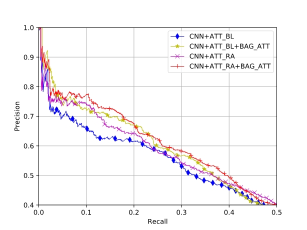
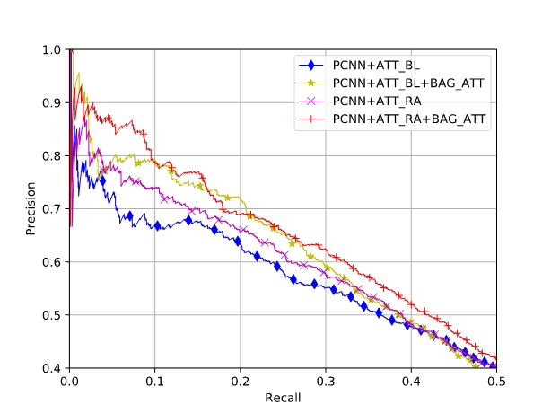

# Intra-Bag and Inter-Bag Attentions


## Dependencies

The code is written in Python 3.6 and pytorch 0.3.0.


## Evaluation Results

### precision/recall curves

Precion/recall curves of CNN+ATT_BL, CNN+ATT_BL+BAG_ATT, CNN+ATT_RA, CNN+ATT RA+BAG ATT

<p align="center"></p>

Precion/recall curves of PCNN+ATT_BL, PCNN+ATT_BL+BAG_ATT, PCNN+ATT_RA, PCNN+ATT_RA+BAG_ATT

<p align="center"></p>

### AUC Results

Model| no BAG_ATT | BAG_ATT
---- | ---- | ----
CNN+ATT_BL | 0.376 | 0.388
CNN+ATT_RA | 0.398 | 0.407
PCNN+ATT_BL | 0.388 | 0.403
PCNN+ATT_RA | 0.403 | **0.422**

## Usage

1. upzip the file `NYT_data/NYT_data.zip`

2. make data folder in the following structure

```
Intra-Bag-and-Inter-Bag-Attentions
|-- figure
    |-- CNNmethods.pdf
    |-- PCNNmethods.pdf
|-- model
    |-- embedding.py
    |-- model_bagatt.py
    |-- pcnn.py
|-- NYT_data
    |-- relation2id.txt
    |-- test.txt
    |-- train.txt
    |-- vec.bin
|-- preprocess
    |-- data2pkl.py
    |-- extract.cpp
    |-- pickledata.py
    |-- preprocess.sh
|-- plot.py
|-- README.md
|-- train.py
```

3. preprocess NYT data

```
cd preprocess; bash preprocess.sh; cd ..
```

4. train model

```
CUDA_VISIBLE_DEVICES=0 python train.py --pretrain --use_RA --sent_encoding pcnn --modelname PCNN_ATTRA
```

5. plot the precision/recall curve

```
python plot.py --model_name PCNN_ATTRA_BAGATT
```


## Cite

If you use the code, please cite the following paper:
**"[Distant Supervision Relation Extraction with Intra-Bag and Inter-Bag Attentions](https://www.aclweb.org/anthology/N19-1288)"**
Zhi-Xiu Ye, Zhen-Hua Ling. _NAACL (2019)_

```
@inproceedings{ye-ling-2019-distant,
    title = "Distant Supervision Relation Extraction with Intra-Bag and Inter-Bag Attentions",
    author = "Ye, Zhi-Xiu  and
      Ling, Zhen-Hua",
    booktitle = "Proceedings of the 2019 Conference of the North {A}merican Chapter of the Association for Computational Linguistics: Human Language Technologies, Volume 1 (Long and Short Papers)",
    month = jun,
    year = "2019",
    address = "Minneapolis, Minnesota",
    publisher = "Association for Computational Linguistics",
    url = "https://www.aclweb.org/anthology/N19-1288",
    pages = "2810--2819",
}
```
